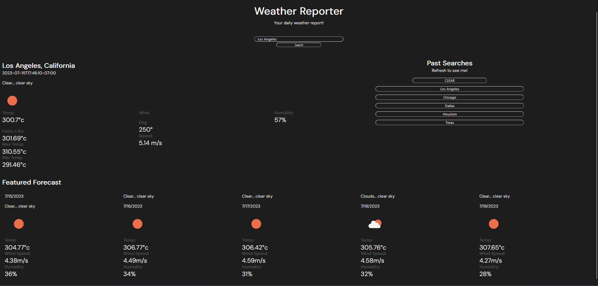

# Weather-Reporter

https://junoandice.github.io/Weather-Reporter/

## Table of Contents

1. [Description](#description)
2. [Screenshots](#screenshots)
3. [Usage](#usage)
4. [Credits](#credits)

## Description

A weather viewer site that allows you to search any city in the world and bring up the current weather, and the weather of the next 5 days.

## Installation

N/A

## Screenshots

## Usage

The site features a header search bar that lets users search any city they please. Once they search a city, it is put into local storage. When the page is loaded, the current and 5 day forecast will be loaded below. Upon refresh, the past searches are pulled from local data and shown on the past searches section. 

## Credits

Ediubong Ekwere | Juno and Ice

With Help from: 
Shawn Davis | DrProfDavis
Pablo Archuleta | xJuanPablo
## License

MIT © Juno and Ice
